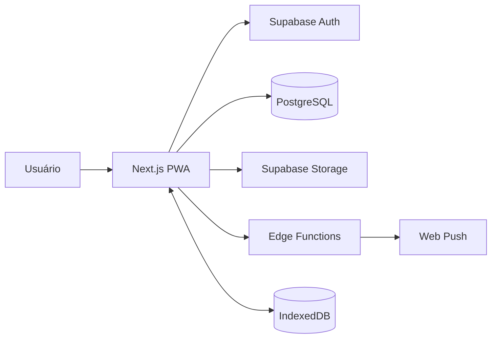

# SenaGest

Sistema web criado para resolver uma necessidade real de organização de operações técnicas, estoque e serviços em campo. O projeto reúne uma interface responsiva, funcionamento como PWA, sincronização offline e um backend baseado em Supabase.

> Versão de portfólio com dados fictícios e sem informações da empresa ou de clientes.

## Funcionalidades

- Autenticação e controle de acesso por perfil
- Cadastro e acompanhamento de serviços técnicos
- Controle de produtos, estoque mínimo e movimentações
- Orçamentos com anexos e geração de PDF
- Pedidos de ferramentas e registro de devoluções
- Registro de ponto da equipe
- Notificações push para eventos operacionais
- Fila offline com sincronização automática
- Cofre criptografado de credenciais com acesso administrativo
- Relatórios de utilização de produtos

## Tecnologias

- Next.js 15 e React 18
- TypeScript
- Tailwind CSS
- Supabase Auth, PostgreSQL, Storage e Edge Functions
- Progressive Web App (PWA)
- IndexedDB para operações offline
- jsPDF para geração de documentos

## Arquitetura



## Como executar

### Pré-requisitos

- Node.js 20 ou superior
- npm
- Projeto configurado no Supabase

### Instalação

```bash
git clone https://github.com/gabrielazkk-dotcom/senagest.git
cd senagest
npm install
copy .env.example .env.local
npm run dev
```

No Linux ou macOS, substitua `copy` por `cp`.

Preencha o `.env.local` com as credenciais públicas do seu projeto Supabase:

```env
NEXT_PUBLIC_SUPABASE_URL=https://seu-projeto.supabase.co
NEXT_PUBLIC_SUPABASE_ANON_KEY=sua-chave-anonima
NEXT_PUBLIC_VAPID_PUBLIC_KEY=sua-chave-publica-vapid
```

Depois, acesse `http://localhost:3000`.

## Banco de dados e funções

O arquivo `schema.sql` contém a estrutura inicial do banco. Alterações posteriores estão organizadas em `supabase/migrations`. As Edge Functions ficam em `supabase/functions` e dependem de segredos configurados diretamente no Supabase, nunca no repositório.

O arquivo `examples/produtos-exemplo.csv` oferece um conjunto pequeno de dados fictícios para testes.

## Qualidade e segurança

- Variáveis sensíveis permanecem fora do controle de versão
- Acesso administrativo é validado no servidor
- Credenciais armazenadas pelo sistema são criptografadas com AES-GCM
- Operações críticas de estoque são executadas de forma transacional
- O modo offline preserva ações e tenta sincronizá-las novamente com segurança

## Autor

Desenvolvido por [Gabriel Sena Santos](https://github.com/gabrielazkk-dotcom) como projeto autoral para solucionar uma necessidade real do dia a dia de trabalho.

Contato: [senadeveloper2@gmail.com](mailto:senadeveloper2@gmail.com)
